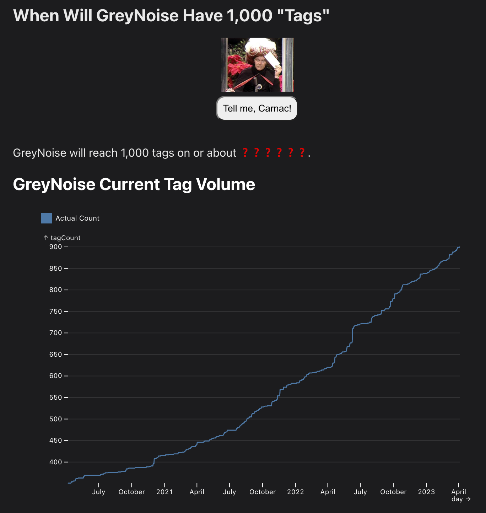

# 🧪 🕸️ WebR, Vite + 🦆 DuckDB via Observable's Standard Library

## A Toy Modeling Example

Experiment parameters:

- Webr
- Observable Standard Library's `DuckDBCLient`
- Observable Plot
- Lit (web components)
- Vite (for building)

Info is [here](https://rud.is/w/webr-vite-duckdb/)

